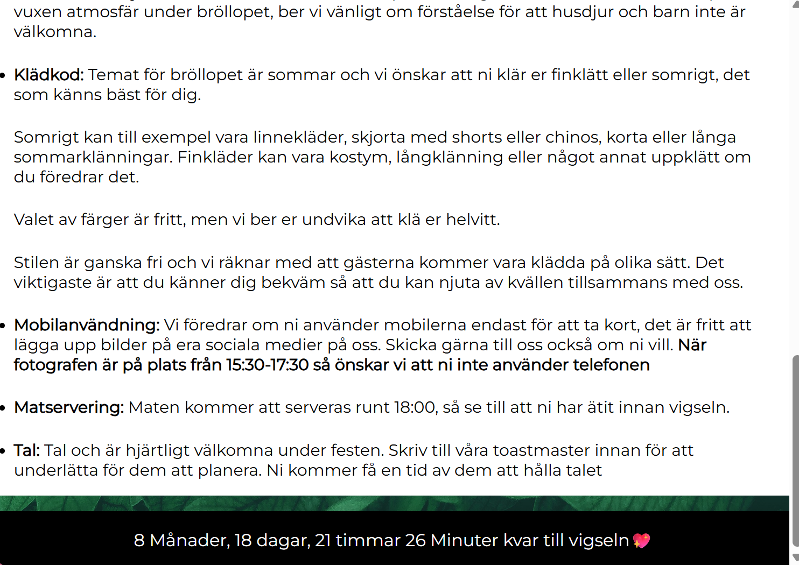
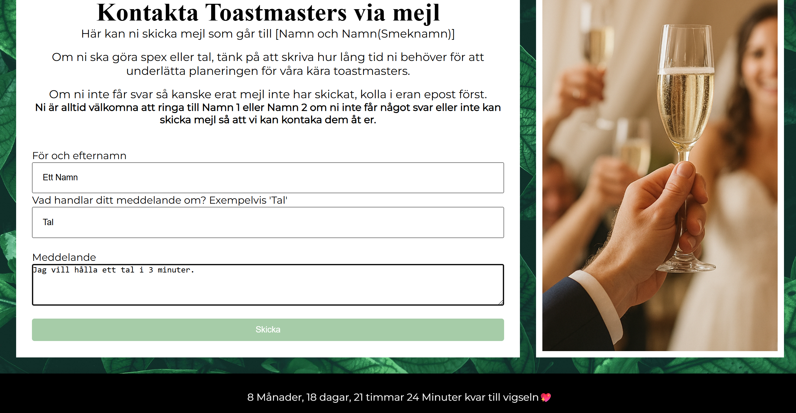
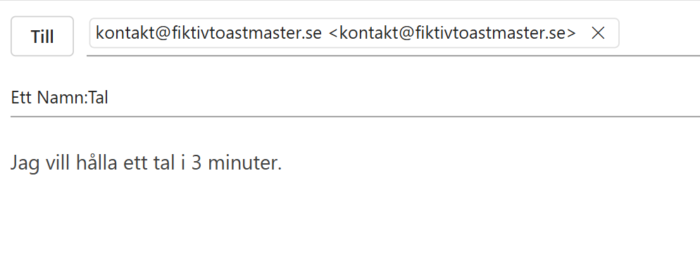

# weddingPage / Bröllopssida
Min personliga bröllopssida (demoversion). Alla namn, bilder och platser är **utbytta** av integritetsskäl.

Byggd med **HTML, CSS och JavaScript** med målet att vara **responsiv** och lättanvänd på dator, surfplatta och mobil.

---

## Skärmdumpar & funktioner

### Startskärm dator
Här visas startskärmen i desktopvy. En **nedräknare** visar tydligt hur lång tid som återstår till bröllopet.

### Startskärm surfplatta och mobil
Responsiv layout som skalar till surfplatta och mobil för bra läsbarhet och navigering.

### OSA (RSVP)
Webbformulär som skickar svar till en bröllopsmejl. **Obligatoriska fält**: fullständigt namn, e-post och svar (tacka ja/nej). Gäster kan även ange **specialkost**, om de vill boka **hotell**, samt vilka de planerar att **dela boende** med för att minska risken för missförstånd mellan gäster. Exempeldata exporteras sedan till **Excel** för uppföljning. Formuläret har **validering** och tydliga felmeddelanden.

 

 

### Platser och hotell
Information om vigsel och bröllopsfest samt tips på hotell. **Kartlänkar** via Google Maps gör att användaren kan trycka på bilden och öppna platsen direkt (alla platser i denna demoversion är utbytta).

### Viktig information
Samlar praktisk information för gäster. Innehållet anpassas efter skärmstorlek.

### Kontakta toastmaster
Kontaktformulär till toastmaster. En **honeypot** används för att minska spam eftersom meddelanden går direkt till vännernas e-post.

### Hjälp för användare (mailto)
Vägledning för gäster som saknar konfigurerad e-postklient eller riskerar att lämna meddelanden i utkast. Skärmdumparna visar hur man skickar mejlet korrekt.

 
 
 
 

