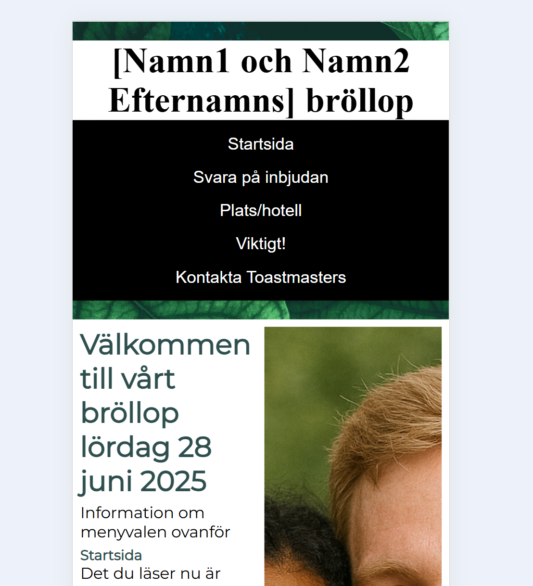

# weddingPage/Bröllopssida 
Min personliga bröllopssida. Denna version innehåller påhittade namn, bilder och platser av integritetsskäl.

Detta är gjort med js kod, html och css och målet var att göra den responsiv. 

## Screenshots med funktioner 
**Startskärm dator**  
Här är olika storlekar på startskärmen så att man kan användad en på olika klienter: 
 

 
**Startskärm padda storlek och mobil**  
Här är andra olika storlekar på startskärmen så att man kan användad en på olika klienter: 
 

 
**OSA**  
Enkelt formulär som skickas som ett mejl till en bröllopsmejl. Med requre på hela namnet, mejl, tacka ja eller nej. Man får också skriva in specialkost och om man tänker ta hotell samt bo med någon om man vill. Detta fyllde jag i sedan i ett exel dokument: 
 

 

 
**Plats och hotell**  
Information om vart  vigsel samt bröllopsfesten ska vara och tips på hotell med google maps plats så att man bara kan trycka på bilden så kommer det upp direkt i google maps, dessa är utbytta till andra platser: 

 
**Viktig information**  
Visar viktig information om bröllopet ser lite olika ut beroende på skärmstorlek: 

 
**T**  
: 

 
**Hjälp för användaren pga mejlto**  
Om användaren inte har outlook eller annat installerat så kommer det bli problem eller om personen inte skickar mejlet utan bara har den i utkast: 
  
  
  
  
